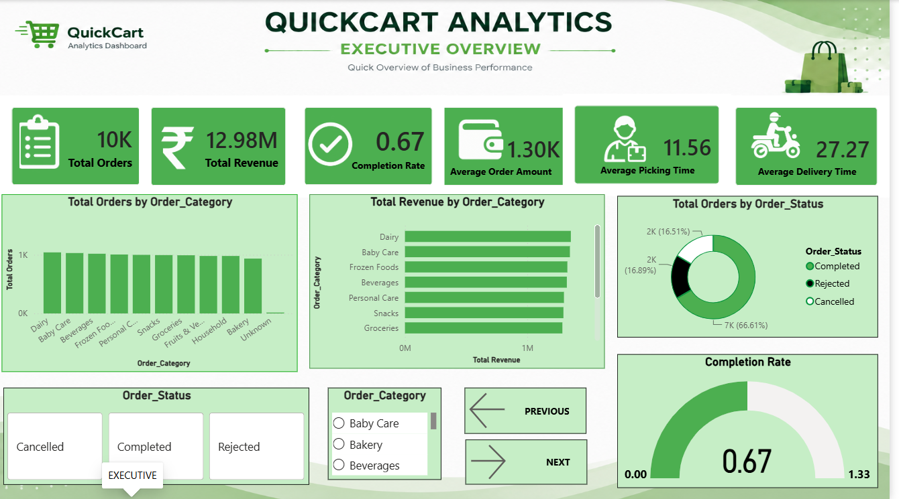
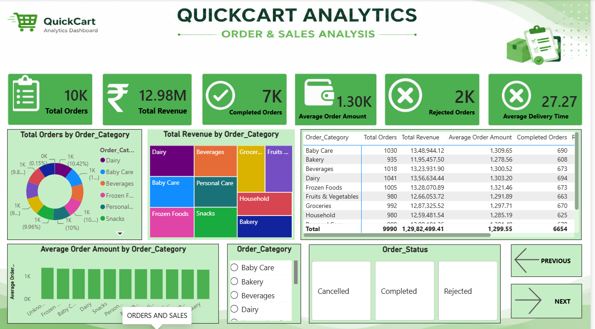
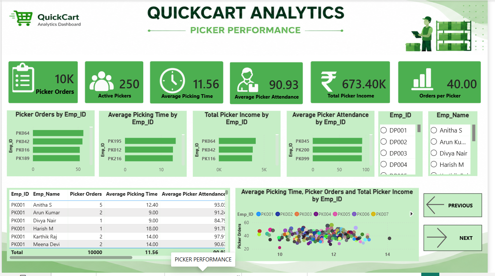
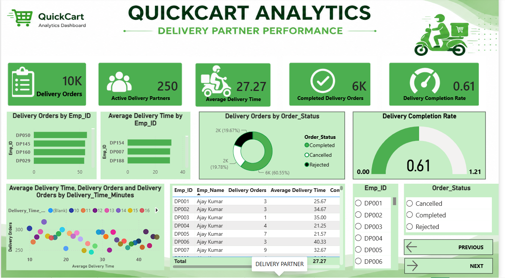
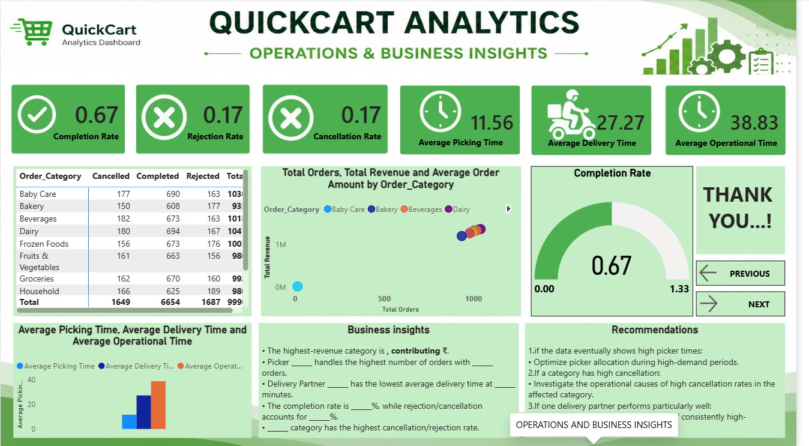

# 🛒 QuickCart Analytics Dashboard

**SQL Server + Power BI Business Intelligence Project**

## Project Overview

QuickCart Analytics is a five-page interactive Power BI dashboard designed to analyze quick-commerce business operations, order and sales performance, picker productivity, delivery partner performance, and operational KPIs.

The project follows an end-to-end BI workflow:

**Data → SQL Server → ETL / Power Query → Data Model → DAX Measures → Power BI Dashboard → Insights & Recommendations**

## Industry
**Quick Commerce / E-Commerce / Retail Operations**

## Objectives
- Analyze total orders and revenue.
- Evaluate order completion, rejection and cancellation.
- Identify category-level order and revenue performance.
- Measure picker productivity, attendance and income.
- Measure delivery-partner workload, speed and completion.
- Compare operational KPIs.
- Provide management-oriented insights and recommendations.

## Tools & Technologies

| Technology | Usage |
|---|---|
| Microsoft SQL Server | Database and SQL analysis |
| SQL | Data extraction, filtering and aggregation |
| Power Query | ETL / data transformation |
| Power BI Desktop | Interactive dashboard |
| DAX | KPI and analytical measures |
| GitHub | Project version control and portfolio |

## Database Tables

- `quickcartdb store_orders`
- `quickcartdb picker`
- `quickcartdb delivery_partner`

# 📊 Dashboard Pages

## 1. Executive Overview

**Purpose:** High-level summary of overall QuickCart business performance.

**KPIs:** Total Orders, Total Revenue, Completion Rate, Average Order Amount, Average Picking Time, Average Delivery Time.

**Visuals:** Orders by Category, Revenue by Category, Order Status Distribution, Completion Rate Gauge, Order Status slicer and Order Category slicer.



---

## 2. Order & Sales Analysis

**Purpose:** Analyze customer orders, category performance, revenue and order status.

**KPIs:** Total Orders, Total Revenue, Completed Orders, Average Order Amount, Rejected Orders, Average Delivery Time.

**Visuals:** Orders by Category, Revenue by Category, Average Order Amount by Category, Category Performance Table, Order Category slicer and Order Status slicer.



---

## 3. Picker Performance ⭐

**Purpose:** Evaluate individual picker productivity, efficiency, attendance and income.

**KPIs:** Picker Orders, Active Pickers, Average Picking Time, Average Picker Attendance, Total Picker Income, Orders per Picker.

**Visuals:** Picker Orders by Employee, Average Picking Time by Employee, Picker Income by Employee, Attendance by Employee, Picker Performance Table and Picker Performance Scatter Chart.



---

## 4. Delivery Partner Performance ⭐

**Purpose:** Evaluate delivery partner productivity, workload, delivery speed and completion.

**KPIs:** Delivery Orders, Active Delivery Partners, Average Delivery Time, Completed Delivery Orders, Delivery Completion Rate.

**Visuals:** Delivery Orders by Employee, Average Delivery Time by Employee, Delivery Status Distribution, Delivery Completion Rate Gauge, Delivery Performance Table and Scatter Chart.



---

## 5. Operations & Business Insights

**Purpose:** Combine business, picker and delivery metrics for management decision-making.

**KPIs:** Completion Rate, Rejection Rate, Cancellation Rate, Average Picking Time, Average Delivery Time, Average Operational Time.

**Visuals:** Category vs Order Status Matrix, Category Orders vs Revenue Scatter, Completion Rate Gauge, Operational KPI Comparison, Business Insights and Recommendations.



# 📈 KPI Summary

| KPI | Purpose |
|---|---|
| Total Orders | Overall order volume |
| Total Revenue | Revenue generated |
| Average Order Amount | Average value per order |
| Completion Rate | Completed-order performance |
| Rejection Rate | Rejected-order proportion |
| Cancellation Rate | Cancelled-order proportion |
| Average Picking Time | Picker processing efficiency |
| Average Delivery Time | Delivery speed |
| Average Operational Time | Combined operational duration |
| Picker Orders | Picker workload |
| Active Pickers | Active picker count |
| Average Picker Attendance | Attendance performance |
| Total Picker Income | Picker earnings |
| Orders per Picker | Workload per picker |
| Delivery Orders | Delivery workload |
| Active Delivery Partners | Active delivery-partner count |
| Completed Delivery Orders | Completed delivery workload |
| Delivery Completion Rate | Delivery completion performance |

# 🔄 Project Workflow

```text
QuickCart Data
      ↓
SQL Server
      ↓
SQL Analysis & Data Preparation
      ↓
Power Query / ETL
      ↓
Data Model & Relationships
      ↓
DAX Measures
      ↓
Power BI Visualizations
      ↓
5-Page Dashboard
      ↓
Business Insights & Recommendations
```

# 📁 Repository Structure

```text
QuickCart-Analytics/
│
├── README.md
│
├── SQL/
│   ├── database_creation.sql
│   ├── data_analysis.sql
│   └── kpi_queries.sql
│
├── PowerBI/
│   └── QuickCart_Analytics.pbix
│
├── Dashboard_Screenshots/
│   ├── 01_Executive_Overview.png
│   ├── 02_Order_and_Sales_Analysis.png
│   ├── 03_Picker_Performance.png
│   ├── 04_Delivery_Partner_Performance.png
│   └── 05_Operations_and_Business_Insights.png
│
├── Documentation/
│   ├── QuickCart_Project_Report.docx
│   └── QuickCart_Project_Report.pdf
│
└── Dataset/
    └── dataset_files_here
```

# 🚀 How to Run

1. Set up the QuickCart database in SQL Server.
2. Execute the SQL scripts.
3. Open `PowerBI/QuickCart_Analytics.pbix`.
4. Update the SQL Server data source if required.
5. Refresh the Power BI model.
6. Use the dashboard navigation and slicers to explore all five pages.

> Do not upload database passwords, connection strings, API keys or other credentials to GitHub.

# 💡 Business Analysis

The dashboard is designed to identify:
- High-volume and high-revenue categories.
- Picker workload and efficiency differences.
- Picker attendance and income patterns.
- Delivery partner workload and delivery speed.
- Order-status patterns.
- Operational bottlenecks.
- Areas requiring management attention.

# 👨‍💻 Author

**Dinesh D M**

**Student ID:** AF05238595  
**Organization:** Anudip Foundation  
**Course:** Data and Business Analyst with AI  
**Branch:** TNJPM  
**Batch:** ANP-D3676  


**Skills:** SQL • Microsoft SQL Server • Power BI • DAX • Power Query • Data Analysis • Data Visualization • Business Intelligence

---

## ⭐ Portfolio Project

This project demonstrates an end-to-end business intelligence workflow from structured database analysis to interactive Power BI reporting and management-level decision support.
